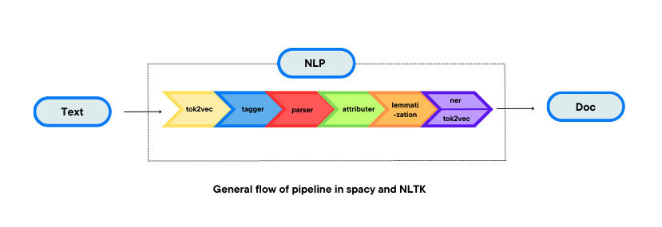

# nlp_py
Perform Natural Language Processing Tasks with Python

Recipe:

    pip install --upgrade pip
    pip install nltk
    pip install spacy 
    pip install -U gensim
    pip install ipython

**Open Python Shell:**

    import nltk
    
    nltk.download('punkt')
    
    exit()

**then, shell terminal**

    python -m spacy download en_core_web_sm

**Open Python Shell:**

    import nltk
    
    sentence = "You not only need technical skills to become a good writer but also need good writing skills."
    
    tokens = nltk.word_tokenize(sentence)
    
    print(tokens)

Clone the repo and test the Python scripts